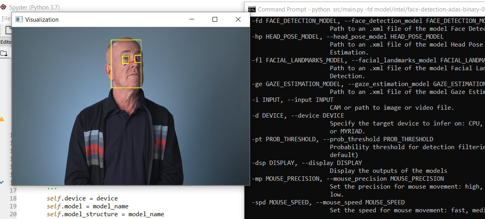
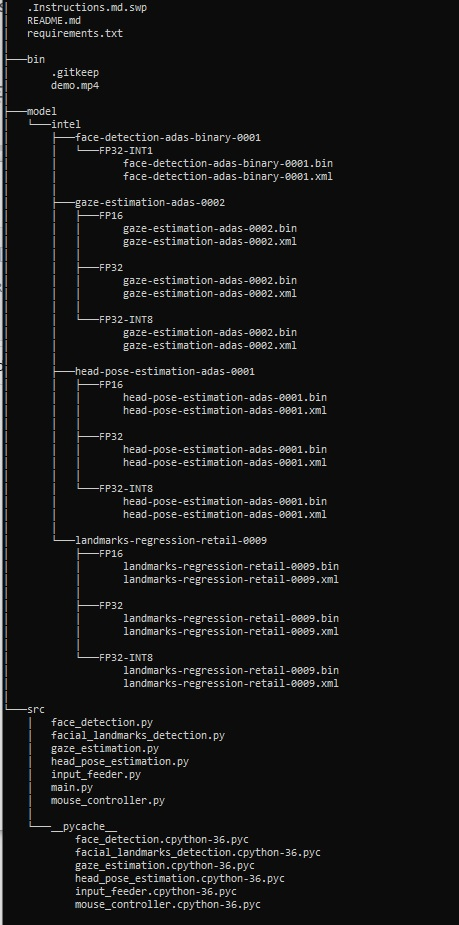

# Computer Pointer Controller

This project is about an application that uses a gaze detection model to control the mouse pointer of a computer with the user's head pose and eyes using an input  video or a live webcam stream.

Gaze Estimation model is used to follow the gaze of the user's head pose and eyes and change the position of the pointer according to the movement of these. 
This project can be run in the same machine using different and multiple models, and the performance can be compared between these models.

This project is using networks from these openvino pretrained models:
- [Face Detection Model](https://docs.openvinotoolkit.org/latest/_models_intel_face_detection_adas_binary_0001_description_face_detection_adas_binary_0001.html)
- [Head Pose Estimation Model](https://docs.openvinotoolkit.org/latest/_models_intel_head_pose_estimation_adas_0001_description_head_pose_estimation_adas_0001.html)
- [Facial Landmarks Detection Model](https://docs.openvinotoolkit.org/latest/_models_intel_landmarks_regression_retail_0009_description_landmarks_regression_retail_0009.html)
- [Gaze Estimation Model](https://docs.openvinotoolkit.org/latest/_models_intel_gaze_estimation_adas_0002_description_gaze_estimation_adas_0002.html)

## Project Set Up and Installation

| Components | Version |
| ------------------- | ------------- |
| Operation System | Windows 10 Pro |
| Configuration | Intel Core i7-8550 CPU @ 1.80 GHz |
| Python | v3.6 |
| OpenVINO | v2020.3 |
| Device | CPU |

Step 1:
OpenVINO Toolkit was installed and run in the computer.
Command Prompt was opened and setupvars.bat batch file was entered in the command to set the
environment variables which OpenVINO bin folder included.

Step 2:
Virtual environment was created: virtualenv venv
Virtual environment was activated: venv\Scripts\activate
Project dependencies were installed in the project directory: pip install requirements.txt

Step 3:
OpenVINO pretrained models were downloaded using OpenVINO model downloader script:
cd C:\Program Files (x86)\IntelSWTools\openvino\deployment_tools\tools\model_downloader\intel
python downloader.py --name face-detection-adas-binary-0001
python downloader.py --name landmarks-regression-retail-0009
python downloader.py --name head-pose-estimation-adas-0001
python downloader.py --name gaze-estimation-adas-0002

These downloaded models were copied to the project directory under the model folder.

## Demo

First, project directory was entered in the command line:

    cd <project path>
    
python src/main.py -fd model/intel/face-detection-adas-binary-0001/FP32-INT1/face-detection-adas-binary-0001.xml -hp model/intel/head-pose-estimation-adas-0001/FP32/head-pose-estimation-adas-0001.xml -fl model/intel/landmarks-regression-retail-0009/FP32/landmarks-regression-retail-0009.xml -ge model/intel/gaze-estimation-adas-0002/FP32/gaze-estimation-adas-0002.xml -i bin/demo.mp4

## Documentation

| Code File | Description
| ------------------- | ------------- |
| main.py | Main project application code file |
| face_detection.py | Face detection prediction file |
| facial_landmarks_detection.py | Face landmarks detection prediction file |
| gaze_estimation.py | Gaze estimation prediction file |
| head_pose_estimation.py | Head pose estimation prediction file |
| input_feeder.py | Input video stream processing file |
| mouse_controller.py | Mouse movement controller file based on the output |

usage: main.py [-h] -fd FACE_DETECTION_MODEL -hp HEAD_POSE_MODEL -fl
               FACIAL_LANDMARKS_MODEL -ge GAZE_ESTIMATION_MODEL -i INPUT
               [-d DEVICE] [-pt PROB_THRESHOLD] [-dsp DISPLAY]
               [-mp MOUSE_PRECISION] [-spd MOUSE_SPEED]

Required parameter details can be called by entering command line:
python3 src/main.py -h

## Benchmarks

| Configuration | Loading Time | Inference Time
| ------------- | ------------- | ------------- |
| CPU – FP32 | 1.0317049026489258  | 96.82043957710266  |
| CPU – FP16  | 1.119312047958374  | 96.75655817985535  |
| CPU – FP32-INT8 | 3.1636881828308105  | 96.66419768333435  |
| GPU – FP32  | 81.63898611068726  | 94.2278106212616  |
| GPU – FP16 | 82.85934448242188  | 93.74738836288452  |
| GPU – FP32-INT8  | 95.18037939071655  | 94.14373850822449  |

## Results

- FP32 is a single-precision floating point format. CPUs and GPUs can run 32-bit floating point operations efficiently.
- FP16 is a half-precision floating point format, which uses the half of the bits that FP32 uses. FP16 has a lower precision level, however it can still perform inference tasks successfully. FP16 requires less space and time than FP32.
- INT8 is an 8-bit integer data type. INT8 data is better on performing calculations than floating point data format, however the range is smaller than FP16 or FP32. INT8 precision can decrease latency and increase throughput on some occasions, but sure it causes a loss of accuracy in the model performance. INT8 precision should be used if needed for the speed not accuracy.
- In this project, FP32, FP16 and INT8 precisions provided similar inference time, but INT8 precision provided longer loading time. For decreasing the required memory, INT8 would be a good choice despite longer loading time.
- However, when using GPU, loading times were increased highly, but inference times were decreased a little bit. GPU can be considered if inference time is important for the project.
